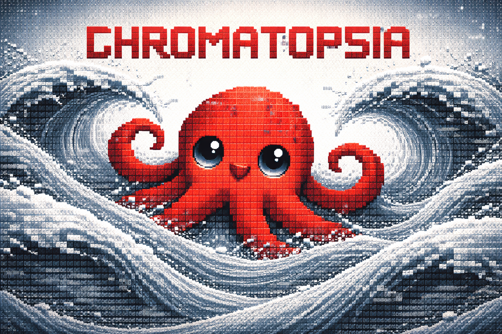
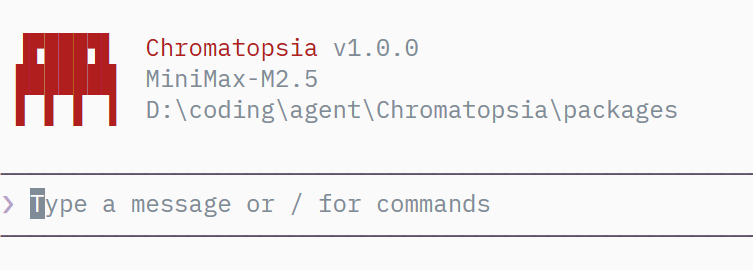

# Chromatopsia

Chromatopsia 是一个面向终端的 coding agent 项目，目标是在本地开发环境中提供接近真实工程协作的代理式编程体验。

当前仓库已经具备：

- 基础 agent runtime 与事件通信层
- 单 Agent TUI 第一版
- 文件、搜索、命令、网页等开发工具
- 审批、摘要、记忆、技能和学习机制的基础框架

整体仍在快速迭代中，但主流程已经可以用于本地实验和持续开发。


## 功能概览

Chromatopsia 当前重点覆盖的是“在终端里完成一个 coding agent 的闭环”：

- **开发工具调用**
  允许 agent 读取文件、编辑文件、搜索代码、执行终端命令、抓取网页内容，并把工具调用结果整理成可读的工作流输出。

- **审批与安全**
  对高风险操作进行拦截和审批确认，避免 agent 在无人确认的情况下直接执行危险命令。

- **上下文管理**
  对长会话进行摘要压缩，维护对话历史与上下文注入，尽可能在长任务里维持有效上下文。

- **技能系统**
  支持把一类重复操作沉淀成 skill，使 agent 可以在命中特定模式时直接复用结构化步骤。

- **Learning（自学习）机制**
  记录用户与 agent 的任务轨迹，在发现重复模式后生成 draft skill，交由人工审核后再纳入正式技能库。


### 当前工作模式

当前仓库主打的是：

- **单 Agent 模式**
- **终端内工作流交互**
- **工具透明执行**

多 Agent 能力还在规划与收敛阶段，尚未接入正式 TUI 主界面。

## 核心能力

### 1. Agent Runtime

Chromatopsia 的 runtime 负责把一次用户输入组织成稳定的事件流，而不是把 UI 直接绑死在模型 SDK 回调上。

这一层当前承担的职责包括：

- 驱动单轮任务执行
- 产出流式文本、工具调用、审批请求、通知、错误等事件
- 为 TUI / CLI 提供统一的消费接口
- 将“模型输出”和“工具执行状态”整理成可显示、可测试的运行时信息

这层设计的核心价值在于：UI 不需要直接理解底层 LLM SDK 的细节，而是消费已经结构化的 runtime 事件。

### 2. TUI 交互界面

当前 TUI 基于 `Ink + React` 构建，已经具备一个可工作的第一版终端界面。

当前已覆盖的交互包括：

- 用户输入
- assistant 流式输出
- 工具调用与工具结果摘要展示
- 审批请求与响应
- 内建命令
- 基础 Markdown 渲染

TUI 目前仍在持续打磨中，重点优化方向包括：

- 视觉层级
- 输入与命令选择体验
- 长文本与复杂工具结果展示
- 首次启动配置引导

## 界面预览



### 3. 工具系统

Chromatopsia 内置了一组面向本地开发的工具，使 agent 不只是“回答问题”，而是可以真实感知和操作本地环境。

当前主要工具能力包括：

- **文件操作**
  - `read`
  - `edit`
  - `glob`

- **代码搜索**
  - `grep`

- **命令执行**
  - `bash`

- **网络能力**
  - `websearch`
  - `webfetch`


### 4. 审批与安全机制

Chromatopsia 内置了审批链路，用于处理高风险或需要人工确认的操作。

典型流程是：

1. agent 发起危险工具调用
2. runtime 发出审批请求
3. UI 进入审批状态
4. 用户确认或拒绝
5. 执行流程继续或中止

这让 agent 能参与真实任务，同时避免默认放开高风险操作。

### 5. 会话、上下文与摘要

Chromatopsia 并不是简单把所有历史消息原样塞回模型，而是尝试把长会话整理成更可持续的上下文。

这一层当前涵盖：

- 会话历史管理
- Token 使用跟踪
- 长对话摘要压缩
- 基于当前任务的上下文注入

目标是让 agent 在长时间任务中维持有效工作上下文，而不是随着会话变长迅速退化。

### 6. 记忆系统

Chromatopsia 支持跨会话保留知识与项目背景，使 agent 不必每次都从零开始理解项目。

记忆系统当前的目标包括：

- 保存历史决策与背景信息
- 在后续任务中做相关记忆检索
- 增强多轮任务之间的连续性

### 7. 技能系统

它的目标不是做花哨插件系统，而是把重复出现的、结构相对稳定的操作模式沉淀下来，让 agent 在合适的时机复用。

当前技能系统支持：

- 内置技能
- 用户自定义技能
- Learning 生成的草稿技能
- 人工审核后启用

### 8. Learning（自学习）机制(实验功能)

Learning 是 Chromatopsia 最值得重点说明的一块，因为它决定了项目不只是“会调工具”，而是尝试把重复任务沉淀成更稳定的执行能力。

#### Learning 解决什么问题

在真实使用中，用户经常会重复让 agent 做类似事情，例如：

- 读取某类文件后给出总结
- 在固定目录下做搜索与替换
- 用相似步骤完成某类工程任务

如果这些行为一遍遍靠自然语言临时驱动，效率会越来越低，也难以稳定复现。

Learning 机制要解决的是：

- 识别重复模式
- 从重复模式中归纳可复用步骤
- 生成候选 skill
- 让人工审核后纳入正式技能库

#### 当前 Learning 的基本流程

1. **记录任务轨迹**
   按 session 记录 turn 级事件，例如任务类型、用户输入、工具调用轨迹等。

2. **识别重复模式**
   当系统发现某类任务多次出现、但又没有命中现有 skill 时，进入候选学习阶段。

3. **生成 draft skill**
   由 LLM 基于近期操作轨迹总结步骤，生成一个草稿技能。

4. **人工审核**
   草稿技能默认不会直接启用，而是需要人工 review / approve / reject。

5. **纳入技能库**
   审核通过后，才成为后续可触发的正式 skill。

#### 为什么要人工审核

Learning 如果直接自动上线，很容易把偶发操作、错误路径或低质量模式固化进主流程。  
因此当前设计强调：

- **先学习**
- **再审核**
- **最后启用**

这能降低“自动学习污染系统行为”的风险。

## 本地启动

### 依赖安装

```bash
pnpm install
```

### 启动 TUI

```bash
pnpm --filter @chromatopsia/tui cli
```

### 当前配置方式

当前启动前需要准备配置文件：

- `packages/agent/config.yaml`

当前还没有正式的首次启动配置向导，因此配置仍然需要手动准备。  
后续计划改为首次启动引导式配置，不再要求用户直接维护仓库内配置文件。

## 仓库结构

- `packages/agent`
  Agent 核心能力、runtime、工具系统、会话与学习相关逻辑

- `packages/agent/tui`
  基于 Ink + React 的终端 UI

- `packages/cli`
  当前本地开发 / 测试用 CLI 入口

## 已知限制

当前版本仍然有这些现实限制：

- 主要以单 Agent TUI 为主
- TUI 交互和视觉仍在持续打磨
- 配置方式还没有收敛到最终形态
- 正式对外发布的 `chroma` 命令还未完成
- 多 Agent 能力尚未接入正式 UI

## Roadmap

### 近期

- 完善 TUI 交互、布局和视觉细节
- 增加首次启动配置向导
- 收敛正式发布入口 `chroma`
- 梳理配置文件、启动路径与发布结构

### 后续

- 多 Agent 支持
- 更完整的任务 / 会话视图
- 更稳定的发布与升级体验
- 更成熟的 Learning -> Skill 沉淀链路
