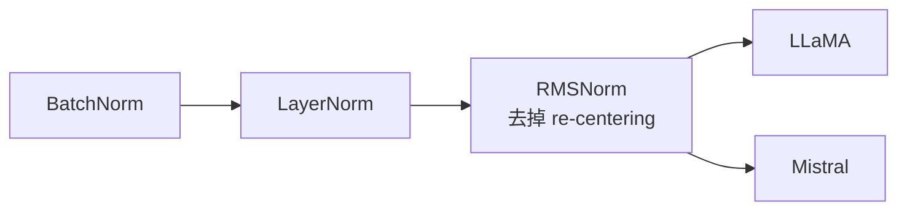

# LLM Concept Explainer

用户学习 LLM 相关知识时，发来一个概念名词，按以下固定结构输出一篇完整的解释。

## When To Use

当用户发来 LLM、Transformer、深度学习训练/推理相关的概念名词，并希望获得结构化解释时使用本 Skill。

如果用户发来的概念较宽泛（如 "Transformer"），先确认是要讲整体架构还是某个子模块，再输出。

## Output Structure

输出必须包含以下六节，顺序固定。

### 1. 是什么 & 用来干什么

- 一句话定位：这个概念属于哪个范畴（优化器 / 归一化 / 注意力机制 / 参数高效微调...）
- 它解决了什么问题 / 为什么需要它
- 和最相近的概念对比一句话（例：比 LayerNorm 少了 re-centering 步骤）
- 如果来自具体论文，注明论文名称和年份

### 2. 在训练 / 推理中起什么作用

- 在 forward pass 里处于哪个位置
- 对梯度 / 收敛 / 显存 / 速度的影响
- 如果有推理阶段的特殊行为（如 KV Cache）也在这里说

### 3. 数学原理与公式

- 用 LaTeX 写出核心公式（行间公式用 `$$...$$`，行内用 `$...$`）
- 逐项解释符号含义
- 给出推导的关键一步（点到为止，不需要全量推导）

### 4. 代码实现

#### 4a. PyTorch 最小实现

- 写一个能独立跑通的最小实现（目标 < 30 行）
- 只用 torch，不依赖其他库
- 代码块使用 ```python
- 代码后紧跟**语法说明**小节，解释非显而易见的 API 和操作

#### 4b. HuggingFace Transformers 真实用法

- 展示这个概念在 HuggingFace 里对应的真实代码位置或使用方式
- 例如：直接调用相关类、通过 config 开启某个选项、或指向源码中的实现位置
- 简短注释说明和 PyTorch 实现的对应关系
- 如果某个概念在 HuggingFace 里没有直接对应（如纯数学概念），本节可改为“在主流框架中的体现”

### 5. 概念关系图

- 用 Mermaid 图（`graph LR` 或 `graph TD`）画出该概念与周边概念的关系
- 节点包含：上游依赖、同类替代方案、下游应用场景、代表性模型

示例：



### 6. 一句话记忆法

- 给用户一句话 slogan，帮助记住这个概念的本质
- 例：「RMSNorm = LayerNorm 去掉均值，只管能量归一化，更快更简洁」

## Style

- 全程中文，术语保留 English 原名（如 re-centering、forward pass）
- 数学公式用 LaTeX 包裹
- 代码块用 ```python
- 简洁为主，不堆砌废话
- 不要输出额外章节，不要改变六节顺序
